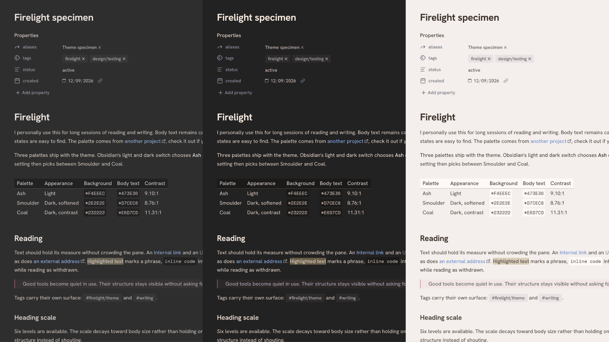
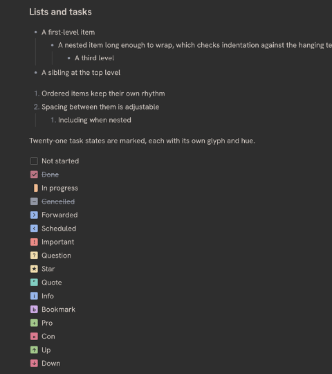
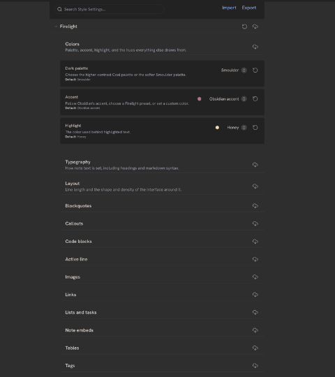

# Firelight

A quiet theme for long reading and writing, built on the [Firelight palette](https://github.com/ridusaini/firelight). Most of it can be adjusted using [Style Settings](https://github.com/mgmeyers/obsidian-style-settings).

## Features

- Three palettes - **Ash** in light, **Smoulder** or **Coal** in dark
- Hanken Grotesk and Space Mono, embedded in the theme, so nothing to install and both work on mobile
- Editor set in either face, whichever suits the writing
- Quiet markdown formatting marks, with three levels of restraint
- Callouts, blockquotes, tags and tables with adjustable surfaces and edges
- Heading scale, heading colors and optional dividers
- Internal and external links can take separate colors
- Twenty-one task states, each with its own glyph and hue
- Focus options that dim inactive panes and fade the interface until you reach for it
- 53 settings in 13 flat sections, no submenus to dig through

## Recommended plugins

- [Style Settings](https://github.com/mgmeyers/obsidian-style-settings) - Firelight looks right without it, but this is how everything above is adjusted.

## Installation

### From Obsidian

1. Open **Settings**
2. Go to **Appearance**
3. Press **Manage** beside Themes
4. Search for **Firelight** and press **Install and use**

### Manual

1. Download `manifest.json` and `theme.css` from the [latest release](../../releases/latest)
2. Create a `Firelight` folder in your vault's `.obsidian/themes/` directory
3. Put both files in it, then select Firelight under **Appearance**

Requires Obsidian 1.8.0 or later.

## Development

[Issues](../../issues) and [pull requests](../../pulls) are welcome, see [CONTRIBUTING](CONTRIBUTING.md) for setup and rules. [Releases](../../releases) has what changed between versions.

`theme.css` is generated - edit `src/theme.css` and run `npm run build`, which inlines the fonts. `./scripts/install-local.zsh test-vault` symlinks the theme into the bundled test vault for trying changes.

## Credits

Colors come from [Firelight](https://github.com/ridusaini/firelight).

### Fonts

Both faces are base64 encoded into the theme, so you don't need to install them and they work on mobile. Their licenses are in `licenses/`.

- [Hanken Grotesk](https://github.com/marcologous/hanken-grotesk) by Alfredo Marco Pradil
- [Space Mono](https://github.com/googlefonts/spacemono) by Colophon Foundry

## License

[MIT](LICENSE)
